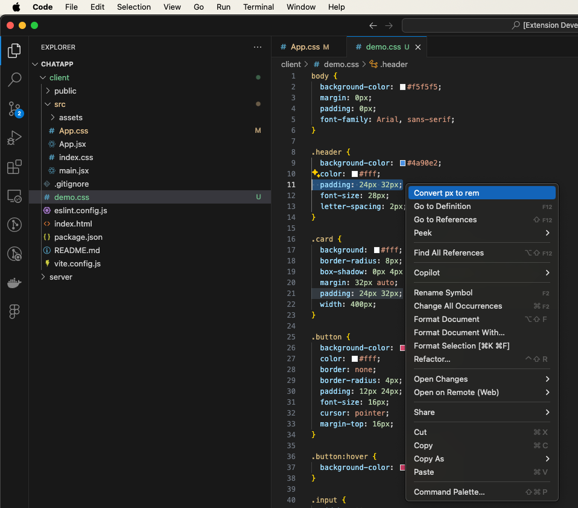

# px-to-rem

This extension helps you convert px units to rem in your code easily with a configurable root font size, making front-end development faster and more consistent.

## Features

- Convert `px` values to `rem` units in selected text or the entire file
- Supports CSS, SCSS, LESS, JavaScript, TypeScript, HTML, and plaintext files
- Configurable base font size (default is 16px)
- Access the command via Command Palette or editor context menu
- Fast and simple workflow to speed up front-end development

<br/>
<br/>



<br/>
<br/>


## Requirements

No additional dependencies or setup are required. Just install the extension and start converting!

## Extension Settings

Include if your extension adds any VS Code settings through the `contributes.configuration` extension point.

For example:

This extension contributes the following settings:

- `px-to-rem.baseFontSize`: Configures the base font size used to calculate rem values. Default is `16`.

Example:

```json
"px-to-rem.baseFontSize": 16
```

### 1.0.0

Initial release of px-to-rem converter with basic px to rem conversion functionality.
